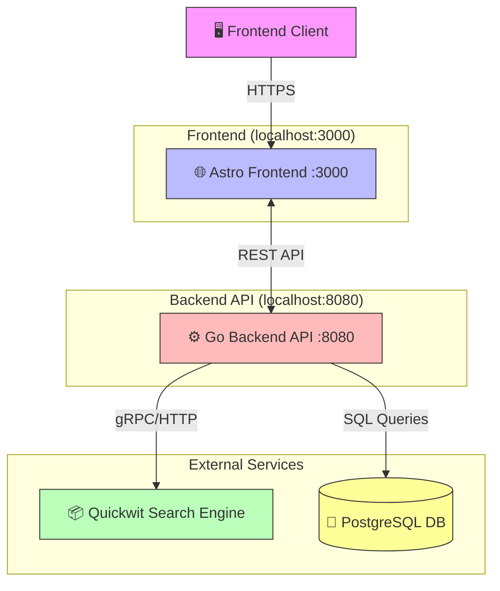
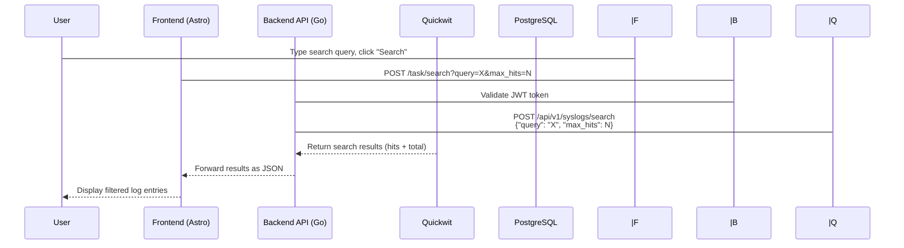

# Project Context: APP - System Log Manager

## 📋 Overview

**APP** is a self-hosted system log management dashboard for viewing, filtering, and analyzing server logs. Built with a focus on performance, simplicity, and developer experience.

### Key Features
- Real-time log streaming with live mode
- Advanced filtering (level, source, host, time range, search)
- Interactive dashboard with charts and metrics
- Export logs to CSV/JSON
- Dark theme UI optimized for long monitoring sessions
- Authentication-ready login/signup pages

---

## 🏗️ Architecture



### Data Flow Example: "Search Logs" Flow



---

## 🛠️ Tech Stack

| Layer | Technology | Purpose |
|-------|------------|---------|
| **Frontend** | Astro 6.3+ | React-like islands architecture for fast, SEO-friendly pages |
| | TypeScript / Vanilla JS | Logic and interactivity |
| | CSS Variables | Dark theme styling |
| **Backend** | Go 1.24.1 | High-performance REST API |
| | Gin Framework | Web framework with middleware support |
| | JWT (golang-jwt) | Authentication |
| **Search** | Quickwit | Log search engine (gRPC/REST) |
| **Database** | PostgreSQL | Metadata storage (users, settings) |
| **Build** | Vite (via Astro) | Fast dev server and production builds |

---

## 📁 Project Structure

```
.
├── backend/                 # Go API Backend
│   ├── components/         # Go template components
│   ├── config/             # Configuration (JWT, Quickwit client)
│   ├── controllers/        # HTTP request handlers
│   ├── exports/            # Static exports (if any)
│   ├── main.go             # Application entry point
│   ├── middleware/         # JWT auth, role-based middleware
│   ├── models/             # Data models (SearchRequest, etc.)
│   ├── pages/              # Go HTML templates (deprecated?)
│   ├── routers/            # Route setup and configuration
│   ├── services/           # Business logic (Quickwit client, JWT)
│   └── static/             # Static assets
│
├── frontend/               # Astro Frontend
│   ├── assets/             # SVG assets
│   ├── components/         # Astro components
│   ├── layouts/            # Layout templates
│   ├── pages/              # Route pages (dashboard, login, signup)
│   ├── scripts/            # Vanilla JS modules
│   ├── styles/             # CSS files
│   ├── astro.config.mjs    # Astro config (Vite build tool)
│   ├── package.json        # Node dependencies
│   └── tsconfig.json       # TypeScript config
│
├── memory/                  # Project notes (Claude memory system)
├── CLAUDE.md               # Project instructions for AI
└── MEMORY.md               # Memory index
```

---

## 🚀 Development Setup

### Prerequisites
- Node.js >= 22.12.0
- Go >= 1.24.1
- Quickwit instance running (external dependency)
- PostgreSQL (for metadata storage)

### Running Locally

#### Option 1: Separate Terminals

**Terminal 1 - Frontend:**
```bash
cd frontend
npm install
npm run dev          # Dev server at http://localhost:3000
```

**Terminal 2 - Backend:**
```bash
cd backend
go mod download
go run main.go       # API at http://localhost:8080
```

**Terminal 3 - Quickwit (if needed):**
```bash
# Start Quickwit instance separately
```

#### Option 2: Environment Variables

Create `.env` in backend directory:
```env
PORT=8080
QUICKWIT_URL=http://localhost:8081
```

### Build & Deploy

**Build Frontend:**
```bash
cd frontend
npm run build
# Output in frontend/dist/
```

**Build Backend:**
```bash
cd backend
go build -o app main.go
# Binary at backend/app
```

**Deploy:**
```bash
# Copy frontend/dist/ to web server
# Run backend/app in production mode
./backend/app
```

---

## 🔑 API Contract

### Authentication

**Login (POST `/api/auth/login`)**
```json
// Request
Authorization: Basic <base64(username:password)>

// Response
{
  "token": "eyJhbG...",
  "refresh_token": "eyJhbG..."
}
```

### Protected Endpoints

| Method | Endpoint | Description |
|--------|----------|-------------|
| GET | `/api/dashboard` | Dashboard data |
| GET | `/api/data-inventory` | Available data sources |
| GET | `/api/logs` | Log entries list |
| GET | `/api/compliance` | Compliance report |
| GET | `/api/settings` | App settings |
| GET | `/api/help` | Help documentation |

### Task/Log Search Endpoints

| Method | Endpoint | Description |
|--------|----------|-------------|
| GET | `/task/search` | Search logs with query |
| GET | `/task/export` | Export logs to file |
| GET | `/task/exports` | List exported files |
| GET | `/task/exports/:filename` | Download exported file |

**Example Search Request:**
```http
GET /task/search?query=8.8.8.8&max_hits=5
```

---

## 📖 Development Guidelines

### Frontend
- Use TypeScript when possible
- Keep components small (Island Architecture)
- Use inline SVG for icons (no external dependencies)
- Prefer vanilla JS over frameworks for simple interactions

### Backend
- Use Go's error wrapping for debugging
- Always validate JWT tokens
- Use Quickwit client for all log searches
- Follow Go's `go generate` patterns for templates

### Styling
- Dark mode only (CSS variables in `:root`)
- Inter font for UI, JetBrains Mono for code/logs
- Use CSS keyframes for animations

---

## 🔧 Troubleshooting

| Issue | Solution |
|-------|----------|
| CORS errors | Check `backend/middleware/setupCORS()` - ensure frontend URL is in `AllowOrigins` |
| JWT not working | Verify `.env` has correct Quickwit URL, check token expiry |
| Search returns empty | Quickwit instance not running or wrong `QUICKWIT_URL` |
| Build fails | Run `npm install` in frontend, `go mod download` in backend |
| Login fails | Use default credentials: `admin@example.com` / `admin123` |

---

## 🔐 Default Credentials

```
Username: admin@example.com
Password: admin123
```

> **Note:** These should be changed in production. The backend currently uses hardcoded credentials - TODO: integrate with proper auth service.

---

## 📚 Quick Links

- [Frontend README](./frontend/README.md)
- [Backend README](./backend/README.md)
- [Astro Config](./frontend/astro.config.mjs)
- [Go Module](./backend/go.mod)

---

*Generated for team onboarding and developer reference*
