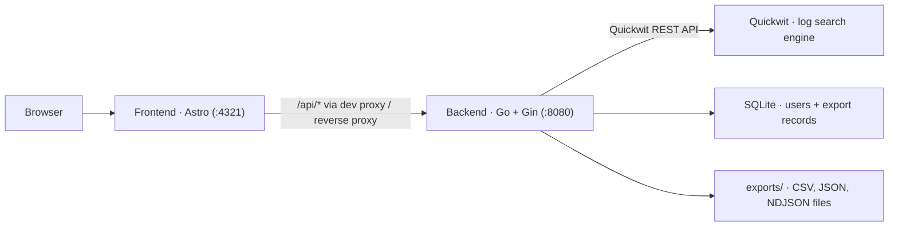
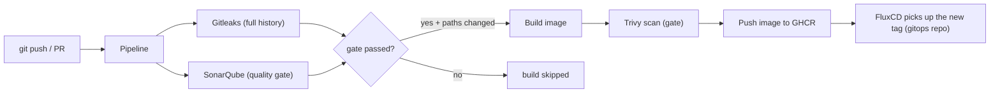

# LUMINA — K3s GitOps Log Platform (Application)

[](https://github.com/traipoap/app/actions/workflows/pipeline.yml)


[](LICENSE)

The **application** layer of the K3s GitOps log platform: a Go API backend and an Astro dashboard for searching, filtering, and exporting platform logs stored in [Quickwit](https://quickwit.io/).

## Features

- JWT authentication — access + refresh tokens, bcrypt password hashing, role-based (admin) access
- Log search UI backed by Quickwit (index listing + query with paging)
- Server-side log export to **CSV / JSON / NDJSON**, listed, downloaded, and deleted from the dashboard
- SQLite persistence (users + export records) — no external database required
- Multi-stage, non-root container images (Alpine)
- Secure CI/CD: Gitleaks + SonarQube gate before build, Trivy scan before push, path-filtered builds, GHCR delivery

## Architecture



The frontend is static-first: it calls same-origin `/api/*`, which the Astro dev server (or a reverse proxy in the cluster) forwards to the backend. The backend in turn proxies search queries to Quickwit and materializes exports as files.

## Tech Stack

| Layer | Tools |
|---|---|
| Backend | Go 1.26+, Gin, GORM + SQLite, golang-jwt, bcrypt |
| Frontend | Astro 7, TypeScript, Vite |
| Containers | Multi-stage Docker builds, Alpine, non-root users |
| CI/CD | GitHub Actions, GHCR |
| Security gates | Gitleaks, SonarQube, Trivy |
| Log engine | Quickwit (deployed by the infra repo) |

## Repository Structure

```
├── backend/            # Go API (auth, search, export)
│   ├── config/             # env + JWT configuration
│   ├── controllers/        # HTTP handlers
│   ├── middleware/         # JWT / role auth
│   ├── models/             # GORM models
│   ├── routers/            # route setup
│   └── services/           # Quickwit client, export, JWT
├── frontend/           # Astro dashboard (pages, components, scripts)
├── docker/             # Dockerfile per service (backend, frontend)
├── .github/workflows/  # pipeline + reusable build/scan/push workflow
├── sonar-project.properties
└── start-app.sh        # local dev runner
```

> Local-only files (gitignored, created at runtime): `backend/data/` (SQLite), `backend/exports/`, and optional `.env` files.

## Prerequisites

| Tool | Minimum Version |
|---|---|
| Go | ≥ 1.26 |
| Node.js | ≥ 22.12 |
| npm | ≥ 10 |

Plus a reachable Quickwit instance (the infra repo deploys it; the local default is `http://127.0.0.1:7280`).

## Quickstart (local development)

### 1. Clone the repository

```bash
git clone https://github.com/traipoap/app.git
cd app
```

### 2. Set the backend environment

`JWT_SECRET` is required — the backend refuses to start without it:

```bash
export JWT_SECRET="$(openssl rand -hex 32)"
export QUICKWIT_URL="http://127.0.0.1:7280"   # optional, this is the default
```

### 3. Run the app

```bash
bash start-app.sh
```

- **Backend** → <http://localhost:8080>
- **Frontend** → <http://localhost:4321> (dev server proxies `/api/*` to the backend)

Prefer manual steps?

```bash
(cd backend && go run main.go) &        # API on :8080
cd frontend && npm install && npm run dev   # dashboard on :4321
```

### 4. Sign in

A demo admin user is seeded on first start:

| Username | Password |
|---|---|
| `admin@example.com` | `admin123` |

> Seeded for local use only — delete or change it before pointing the dashboard at real data.

## Environment Variables

### Backend

| Variable | Required | Default | Description |
|---|---|---|---|
| `JWT_SECRET` | ✅ | — | HMAC secret for signing access/refresh tokens |
| `QUICKWIT_URL` | | `http://127.0.0.1:7280` | Base URL of the Quickwit API |
| `BACKEND_PORT` | | `8080` | HTTP listen port |
| `CORS_ORIGINS` | | `http://localhost:4321, http://127.0.0.1:4321` | Comma-separated allowed origins |
| `DATABASE_PATH` | | `backend/data/users.db` | SQLite file location |

### Frontend

| Variable | Default | Description |
|---|---|---|
| `API_PROXY_TARGET` | `http://localhost:8080` | Where dev/preview servers proxy `/api/*` |
| `ALLOWED_HOSTS` | `localhost,127.0.0.1` | Comma-separated allowed hostnames (Vite host check) |

## API

All `/api` endpoints except `login`/`refresh` require `Authorization: Bearer <access token>`. Search and export endpoints are restricted to the `admin` role.

| Method | Path | Description |
|---|---|---|
| `POST` | `/api/auth/login` | Sign in → access + refresh tokens |
| `POST` | `/api/auth/refresh` | Exchange a refresh token for a new access token |
| `POST` | `/api/auth/logout` | Log out |
| `GET` | `/api/profile` | Current user profile |
| `GET` | `/api/indices` | List Quickwit indexes |
| `GET` | `/api/search` | Search logs (query, index, paging) |
| `GET` | `/api/export` | Trigger a server-side export |
| `GET` | `/api/exports` | List generated exports |
| `GET` | `/api/exports/:filename` | Download an export |
| `DELETE` | `/api/exports/:filename` | Delete an export |

Example:

```bash
TOKEN="<access token>"
curl "http://localhost:8080/api/search?query=8.8.8.8&max_hits=5" \
  -H "Authorization: Bearer $TOKEN"
```

## Docker

```bash
docker build -t lumina-backend -f docker/backend/Dockerfile .
docker build -t lumina-frontend -f docker/frontend/Dockerfile .
```

Both images are multi-stage and run as a non-root user. The backend image requires `JWT_SECRET` at runtime, and the frontend image takes `ALLOWED_HOSTS` / `API_PROXY_TARGET` as build args or env.

## CI/CD Pipeline

The pipeline uses GitHub Actions (`.github/workflows/pipeline.yml`). On each push to `main` (or any PR):

1. **Security gate** — Gitleaks (secret scan of the full history) + SonarQube (code quality and security analysis). If either fails, the builds are skipped entirely.
2. **Build** — only for services whose paths changed (`backend/**` + `docker/backend/**`, `frontend/**` + `docker/frontend/**`).
3. **Trivy scan** — vulnerability scan of the local image **before** push. Fixable CRITICAL/HIGH findings block the push; the SARIF report lands in the GitHub Security tab.
4. **Push** — the image goes to GHCR (`ghcr.io/traipoap/backend`, `ghcr.io/traipoap/frontend`, tagged `0.0.<run_number>`).

> The pipeline stops at a verified, pushed image. Cluster-side deployment is driven by FluxCD in the [gitops repository](https://github.com/traipoap/gitops).

A `workflow_dispatch` trigger with `force_build = true` rebuilds both services on demand (e.g., after docs-only changes or SonarQube fixes).



### Repository secrets and variables

| Type | Name | Used by |
|---|---|---|
| Variable | `SONAR_HOST_URL` | SonarQube job |
| Secret | `SONAR_TOKEN` | SonarQube job |
| Secret | `TOKEN_REGISTRY` | GHCR login (build & push steps) |

> All secrets live in GitHub **Settings → Secrets and variables → Actions**. Nothing is hardcoded in the workflow files. The SonarQube project key is not a secret, so it lives in [`sonar-project.properties`](sonar-project.properties).

## Deployment

This repository intentionally contains **no cluster manifests**. FluxCD lives in the [gitops repository](https://github.com/traipoap/gitops), whose HelmReleases reference the GHCR images this pipeline publishes. FluxCD detects the new tag and rolls the update in-cluster — the pipeline's job ends at a verified, pushed image.

## Security

**In place:**

- JWT authentication (15-minute access tokens, 7-day refresh) with bcrypt-hashed passwords
- Role-based access — search/export endpoints are admin-only
- CORS restricted to configured origins
- Multi-stage, non-root container images with minimal Alpine bases
- Gitleaks secret scanning of the full git history before every build
- SonarQube quality gate — new security issues fail the pipeline
- Trivy image scan before push — fixable CRITICAL/HIGH blocks the release
- Private registry authentication (GHCR fine-grained PAT, no hardcoded credentials)

**Planned improvements:**

- OIDC (workload identity) for GHCR push instead of a PAT
- cosign image signing with Flux verification
- SBOM (syft) published as build artifacts

## Troubleshooting

**Backend won't start:**

```
JWT_SECRET environment variable is required
```

→ `export JWT_SECRET="$(openssl rand -hex 32)"` and restart.

**Search returns errors or no indexes:**

```bash
curl "$QUICKWIT_URL/api/v1/indexes"
```

→ Confirm the Quickwit URL is reachable from the machine running the backend.

**401 / CORS errors in the dashboard:**

- The access token expires after 15 minutes — sign in again (the client auto-refreshes).
- If the dashboard is served from a different origin, add it to the backend's `CORS_ORIGINS`.

**Frontend dev server can't reach the API:**

→ Check `API_PROXY_TARGET` (shell env or `frontend/.env`) points at the running backend.

**Reset local state:** delete `backend/data/users.db` and `backend/exports/`.

## Related Repositories

| Repository | Purpose |
|---|---|
| [traipoap/traipoap](https://github.com/traipoap) | Summary — platform overview and documentation |
| [traipoap/infra](https://github.com/traipoap/infra) | Infrastructure — Proxmox VMs (Terraform) + K3s cluster setup (Ansible) |
| [traipoap/app](https://github.com/traipoap/app) | Application — this repository (Go/Gin API + Astro dashboard) |
| [traipoap/gitops](https://github.com/traipoap/gitops) | GitOps — FluxCD manifests (HelmReleases, Kustomizations) |

> FluxCD in the gitops repo picks up the GHCR images published by this repo's pipeline — that is the entire deployment loop.

## Contributing

Contributions are welcome!
- Open an [issue](https://github.com/traipoap/app/issues) for bugs or ideas
- Submit a [pull request](https://github.com/traipoap/app/pulls) for improvements

Please keep changes consistent with the existing style and update the documentation.

## License

This project is licensed under the Apache 2.0 license — see the [LICENSE](LICENSE) file.
