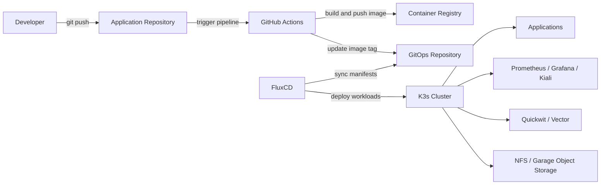
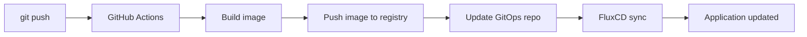

# K3s GitOps Platform on Proxmox


A production-oriented home lab / portfolio platform for provisioning and managing a Kubernetes cluster using Infrastructure as Code, GitOps, CI/CD, observability, and security best practices.

This project demonstrates how to build a repeatable, declarative, and automated Kubernetes platform from bare-metal/virtual infrastructure to application deployment.

---

## 🏗 Overview

This project automates the deployment and management of a K3s Kubernetes cluster on Proxmox virtual machines using Terraform and Ansible.

The cluster is managed using a GitOps workflow with FluxCD. All infrastructure and Kubernetes workloads are declared in Git, and FluxCD continuously reconciles the cluster state with the desired state defined in the repository.

The platform includes:

- Automated VM and infrastructure provisioning
- Automated Kubernetes cluster installation
- GitOps-based application and infrastructure management
- CI/CD pipeline using GitHub Actions
- Monitoring and logging stack
- Service mesh visibility with Istio and Kiali
- Object storage using Garage
- TLS automation using cert-manager

---

## Architecture



---

## Features
- Provision virtual machines on Proxmox using Infrastructure as Code
- Automate system prerequisites and kernel tuning with Ansible
- Install and configure a K3s Kubernetes cluster
- Manage Kubernetes workloads using GitOps with FluxCD
- Deploy infrastructure components using Kustomize and Helm
- Build and publish container images using GitHub Actions
- Automatically update GitOps repository when new images are built
- Monitor cluster and workloads with Prometheus and Grafana
- Visualize service mesh traffic with Kiali
- Collect and query logs using Vector and Quickwit
- Provide S3-compatible object storage using Garage
- Automate TLS certificates with cert-manager
- Store cluster configuration declaratively in Git

---

## Tech Stack
#### Infrastructure
- Proxmox VE
- Terraform
- Ansible
- Linux
- NFS
#### Kubernetes
- K3s
- kubectl
- Helm
- Kustomize
- FluxCD
- Istio
- cert-manager
#### CI/CD
- GitHub Actions
- Docker
- Container Registry
#### Observability
- Prometheus
- Grafana
- Kiali
- Vector
- Quickwit
#### Storage
- NFS
- Garage Object Storage, S3-compatible

---

## Repository Structure

```
.
├── ansible
│   ├── ansible.cfg
│   ├── inventory
│   │   └── hosts
│   ├── playbooks
│   │   ├── 00-prerequisites.yml
│   │   ├── 01-cluster-setup.yml
│   │   ├── 02-servicemesh.yml
│   │   ├── 03-gitops-bootstrap.yml
│   │   ├── 04-storage-networking.yml
│   │   ├── 05-garage-deploy.yml
│   │   ├── files
│   │   │   └── k3s-kubeconfig.yaml
│   │   └── pipeline.sh
│   └── roles
│       ├── common
│       │   └── tasks
│       │       └── main.yml
│       ├── fluxcd
│       │   └── tasks
│       │       └── main.yml
│       ├── garage
│       │   ├── tasks
│       │   │   └── main.yml
│       │   └── templates
│       │       ├── garage.toml.j2
│       │       └── systemd
│       │           └── garage.service.j2
│       ├── istio
│       │   └── tasks
│       │       └── main.yml
│       ├── k3s-agent
│       │   └── tasks
│       │       └── main.yml
│       ├── k3s-server
│       │   └── tasks
│       │       └── main.yml
│       ├── load-balance
│       │   ├── tasks
│       │   │   └── main.yml
│       │   └── templates
│       │       └── haproxy.cfg.j2
│       ├── nfs
│       │   ├── tasks
│       │   │   └── main.yml
│       │   └── templates
│       │       └── exports.j2
│       └── runtime
│           └── tasks
│               └── main.yml
├── backend
│   ├── config
│   │   ├── config.go
│   │   └── jwt.go
│   ├── controllers
│   │   ├── export_controller.go
│   │   ├── exports_list_controller.go
│   │   ├── protected_controller.go
│   │   ├── register_controller.go
│   │   ├── search_controller.go
│   │   └── signin_controller.go
│   ├── exports
│   │   ├── 192.168.1.1_20260401_213305.csv
│   │   └── 192.168.1.1_20260401_213305.zip
│   ├── go.mod
│   ├── go.sum
│   ├── main.go
│   ├── middleware
│   │   └── jwt.go
│   ├── models
│   │   ├── export.go
│   │   ├── jwt.go
│   │   ├── register.go
│   │   └── search.go
│   ├── routers
│   │   └── routers.go
│   ├── services
│   │   ├── download_service.go
│   │   ├── export_service.go
│   │   ├── jwt.go
│   │   └── quickwit_client.go
│   └── users.db
├── docker
│   ├── backend
│   │   └── Dockerfile
│   └── frontend
│       └── Dockerfile
├── docker-compose.yml
├── frontend
│   ├── astro.config.mjs
│   ├── frontend.md
│   ├── package.json
│   ├── package-lock.json
│   ├── public
│   │   ├── favicon.ico
│   │   └── favicon.svg
│   ├── src
│   │   ├── assets
│   │   │   ├── astro.svg
│   │   │   ├── background.svg
│   │   │   └── logout.svg
│   │   ├── components
│   │   │   └── Welcome.astro
│   │   ├── layouts
│   │   │   └── Layout.astro
│   │   ├── pages
│   │   │   ├── 404.astro
│   │   │   ├── dashboard.astro
│   │   │   ├── index.astro
│   │   │   ├── signin.astro
│   │   │   └── signup.astro
│   │   ├── scripts
│   │   │   └── dashboard.js
│   │   └── styles
│   │       ├── logs.css
│   │       ├── main.css
│   │       ├── signin.css
│   │       └── signup.css
│   └── tsconfig.json
├── README.md
├── start-app.sh
└── terraform
    ├── backend.tf
    ├── hosts.tpl
    ├── locals.tf
    ├── main.tf
    ├── provider.tf
    ├── secrets.auto.tfvars
    └── variables.tf

49 directories, 81 files
```

---

## Quickstart
#### Clone the repository:
```
git clone https://github.com/traipoap/app.git
cd app
```

#### Copy the example environment file:
```
cp .env.example .env
```
#### Edit .env with your environment values:
```
export PROXMOX_HOST="proxmox.example.local"
export PROXMOX_USER="root@pam"
export VM_COUNT=3
export REGISTRY="ghcr.io/YOUR_USERNAME"
export CLUSTER_NAME="k3s-home-lab"
```

---

## GitOps Workflow
This project uses FluxCD as the GitOps operator.
FluxCD watches this Git repository and reconciles the cluster state using:
- GitRepository
- Kustomization
- HelmRepository
- HelmRelease

Bootstrap FluxCD:
```
flux bootstrap git \
  --url=ssh://git@github.com/YOUR_USERNAME/k3s-gitops-platform.git \
  --branch=main \
  --path=clusters/k3s/flux/bootstrap \
  --personal
```
Check FluxCD status:
```
flux get all -A
```
Check Kubernetes resources:
```
kubectl get nodes
kubectl get pods -A
kubectl get gitrepositories -A
kubectl get kustomizations -A
kubectl get helmreleases -A
```
---

## CI/CD Pipeline
#### The CI/CD pipeline uses GitHub Actions.
#### When code is pushed to the repository, the pipeline performs:
1. Lint and test the application
2. Build a Docker image
3. Push the image to a container registry
4. Update the GitOps repository with the new image tag
5. FluxCD detects the change and deploys the new version
#### Example workflow:


---

## Observability
#### Prometheus
#### Prometheus is used to collect metrics from the cluster and workloads.
#### Access Prometheus locally:
```
kubectl -n monitoring port-forward svc/prometheus-server 9090:9090
```
#### Open:
```
http://localhost:9090
```
### Grafana
#### Grafana is used for dashboards and visualization.
#### Access Grafana locally:
```
kubectl -n monitoring port-forward svc/grafana 3000:3000
```
#### Open:
```
http://localhost:3000
```

### Kiali
#### Kiali provides visibility into Istio service mesh traffic.
#### Access Kiali locally:
```
kubectl -n istio-system port-forward svc/kiali 20001:20001
```
#### Open:
```
http://localhost:20001
```

### Logging
#### Logs are collected using Vector and stored/queryable in Quickwit.
#### Example log access:
```
kubectl -n logging get pods
kubectl -n logging logs -l app.kubernetes.io/name=vector
```
#### If Quickwit UI is exposed:
```
kubectl -n logging port-forward svc/quickwit 7280:7280
```
#### Open:
```
http://localhost:7280
```

---

## Storage
#### NFS
NFS is used for persistent storage in this lab environment.
Example StorageClass:
```
apiVersion: storage.k8s.io/v1
kind: StorageClass
metadata:
  name: nfs-client
provisioner: nfs.example.local
parameters:
  server: nfs.example.local
  path: /exports/kubernetes
reclaimPolicy: Retain
volumeBindingMode: Immediate
```

## Garage Object Storage
#### Garage provides S3-compatible object storage.
Example use cases:
- Backup storage
- Application assets
- Registry storage backend
- S3-compatible testing

---

## Security
#### This project applies several Kubernetes security practices:
- TLS certificates managed by cert-manager
- Declarative configuration managed through Git
- Secrets separated from application manifests
- Namespace isolation
- RBAC for access control
- Pod security best practices
- Automated reconciliation to reduce configuration drift
#### Recommended additional security improvements:
- SOPS + age for secret encryption
- External Secrets Operator
- Kyverno or OPA Gatekeeper policies
- NetworkPolicies
- Container image scanning
- Signed container images
- Private registry authentication


---

## Backup and Restore
#### Recommended backup targets:
- etcd snapshots
- Kubernetes resource manifests
- Persistent volumes
- GitOps repository
- Secrets
- NFS data
- Garage object storage data
#### Example tools:
- Velero
- Kopia
- Restic
- etcd snapshot
- Longhorn snapshots, if using Longhorn
See:
```
docs/backup-restore.md
```

---

## Troubleshooting
Check node status
```
kubectl get nodes -o wide
kubectl describe node <node-name>
```

Check pod status
```
kubectl get pods -A
kubectl describe pod <pod-name> -n <namespace>
kubectl logs <pod-name> -n <namespace>
kubectl logs <pod-name> -n <namespace> --previous
```

Check FluxCD status
```
flux get all -A
flux get kustomizations -A
flux get helmreleases -A
```

Force FluxCD reconciliation
```
flux reconcile source git flux-system -n flux-system
flux reconcile kustomization <name> -n <namespace> --with-source
```

Check HelmRelease status
```
kubectl describe helmrelease <name> -n <namespace>
kubectl get events -n <namespace> --sort-by=.metadata.creationTimestamp
```

---

## Results / Impact
### Replace the example metrics below with your real results.
- Reduced infrastructure provisioning time from several hours to approximately 20 minutes
- Eliminated manual Kubernetes deployment steps using GitOps
- Improved environment consistency by defining all workloads declaratively
- Enabled repeatable cluster rebuild from Git and automation scripts
- Improved observability using Prometheus, Grafana, Kiali, and centralized logging
- Reduced configuration drift through continuous reconciliation by FluxCD

---

## Lessons Learned
- GitOps improves consistency and auditability compared to manual kubectl apply
- Infrastructure automation requires careful handling of secrets and state files
- Observability should be installed early, not after problems occur
- Backup and restore testing is as important as deployment automation
- Kubernetes troubleshooting requires strong Linux and networking fundamentals

---

## Roadmap
- Add Velero backup and restore testing
- Add Kyverno policy enforcement
- Add NetworkPolicies for namespace isolation
- Add SOPS or External Secrets for secret management
- Add image vulnerability scanning in CI
- Add automated testing for Kubernetes manifests
- Add multi-environment promotion: dev, staging, production
- Add disaster recovery runbook with measured RTO/RPO
- Add Longhorn or Ceph for more production-grade storage
- Add OpenTelemetry tracing

---

## License
This project is licensed under the MIT License.
