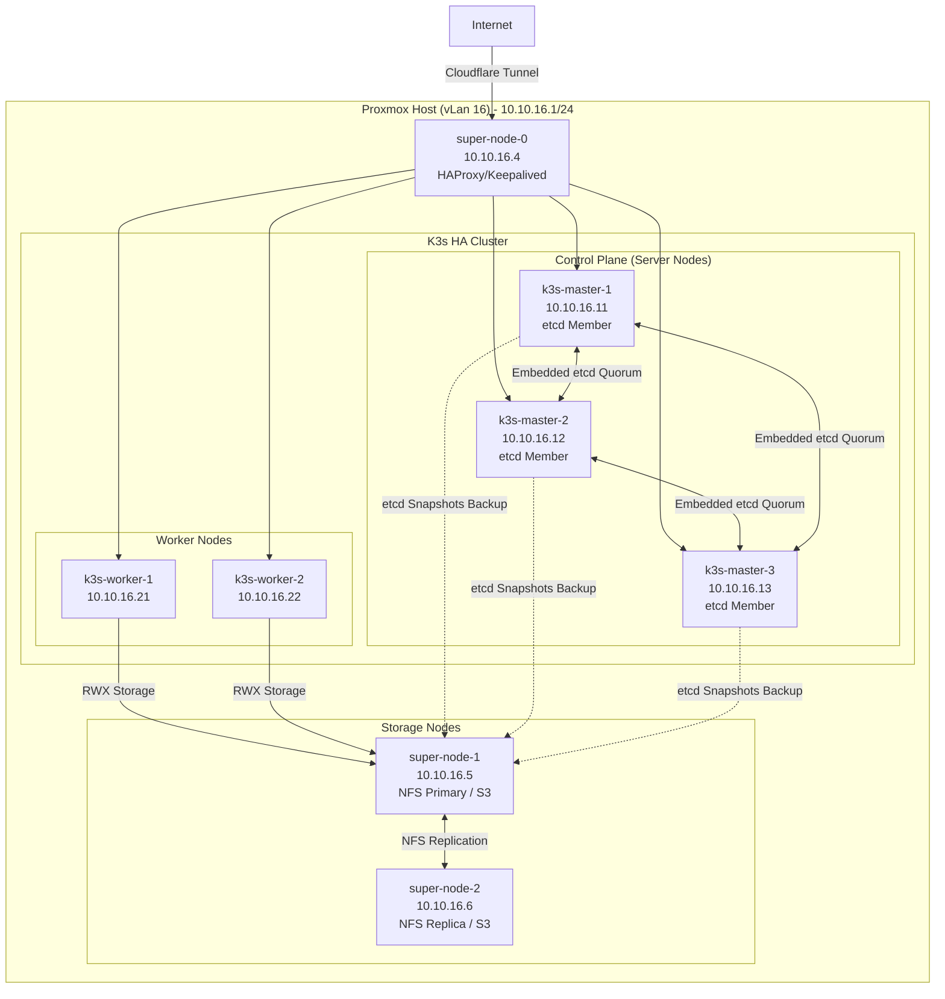
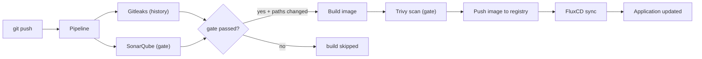

# K3s GitOps Platform on Proxmox

[](https://github.com/traipoap/gitops-platform/actions/workflows/pipeline.yml)


[](LICENSE)

แพลตฟอร์มระดับ production สำหรับสร้างและจัดการ Kubernetes cluster บน Proxmox Automate setup ทั้งหมด — ตั้งแต่ virtual machines ไปจนถึงการ deploy แอปพลิเคชัน — โดยใช้ Infrastructure as Code (IaC), GitOps, CI/CD, monitoring และเครื่องมือด้านความปลอดภัย

Repository นี้แสดงวิธีรันแพลตฟอร์ม Kubernetes แบบที่ทำซ้ำได้ (repeatable), declarative และ automated ทั้งหมด

## ฟีเจอร์

- สร้าง virtual machines บน Proxmox ด้วย Terraform
- ตั้งค่าข้อกำหนดก่อนเริ่มและ tune kernel ด้วย Ansible
- ติดตั้ง K3s Kubernetes cluster (พร้อม high availability)
- จัดการ workloads ด้วย GitOps โดยใช้ FluxCD
- Deploy components ด้วย Kustomize และ Helm
- สร้างและ publish images ด้วย GitHub Actions
- อัปเดต GitOps repository อัตโนมัติเมื่อสร้าง image ใหม่
- Monitor cluster ด้วย Prometheus และ Grafana
- ดู traffic ของ service mesh ด้วย Istio และ Kiali
- เก็บและ query log ด้วย Vector และ Quickwit
- S3-compatible object storage ด้วย Garage
- TLS certificates อัตโนมัติด้วย cert-manager
- Security gate ก่อน build: Gitleaks สแกน secret, SonarQube คุณภาพโค้ด และ Trivy สแกน image — block release ที่มีปัญหาหรือมีช่องโหว่
- Cluster policy ด้วย Kyverno และ in-cluster secrets ด้วย External Secrets Operator

## การตัดสินใจด้านสถาปัตยกรรม

การตัดสินใจสำคัญและเหตุผลเบื้องหลังแต่ละข้อ:

| # | การตัดสินใจ | เหตุผล |
|---|---|---|
| 1 | ใช้ K3s แทน Kubernetes เต็มรูปแบบ | Single binary ที่ออกแบบมาสำหรับ VM ขนาดเล็ก (1 vCPU / 2–8 GB) ใช้แรมน้อย มี etcd ในตัว ใช้กับ Helm และ Gateway API ได้ |
| 2 | HA ด้วย embedded etcd | ไม่ต้องมี database แยกให้ต้องดูแล master ตัวแรกเริ่ม cluster ตัวอื่น join ด้วย shared token |
| 3 | Super-node ตัวเดียวสำหรับ LB + NFS + S3 | Lab มี VM จำกัด edge services จึงแชร์ VM เดียวเพื่อประหยัด RAM และดิสก์ |
| 4 | Terraform สำหรับ VM, Ansible สำหรับซอฟต์แวร์ | Terraform ดูแล infrastructure state, Ansible ดูแล software state ทั้งสองทำซ้ำได้จาก repo |
| 5 | ขยายแบบ count-based | เปลี่ยนตัวเลข 3 ตัวเพื่อขยาย cluster ชื่อ, vm_id และ IP ถูกสร้างตาม role |
| 6 | GitOps ด้วย FluxCD | การเปลี่ยนแปลงทั้งหมดผ่าน Git Drift ถูกซ่อมอัตโนมัติ และ history อยู่ git |
| 7 | Istio พร้อม Gateway API | Ingress มาตรฐานพร้อม mTLS และ traffic policies Kiali แสดงให้เห็น traffic |
| 8 | Storage 2 ชั้น: NFS + Garage | NFS สำหรับ shared state, Garage สำหรับ S3 objects ทั้งสองรันที่จุดที่ข้อมูลอยู่ |
| 9 | Clone จาก template VM | เร็ว (~3 นาที) และสม่ำเสมอ Cloud-init ตั้งแค่ hostname, user และ IP |
| 10 | Secrets อยู่นอก git | Terraform อ่าน tfvars, Ansible อ่าน env vars Secrets ไม่เข้า repo เลย |
| 11 | Vector + Quickwit สำหรับ log | Stack logging แบบเบาสบายที่เหมาะกับ lab |
| 12 | Proxmox VE เป็น hypervisor | แพลตฟอร์ม KVM open-source ที่พิสูจน์แล้ว พร้อม API ที่ชัดเจนให้ Terraform ใช้โดยตรง |
| 13 | GitHub Actions + GHCR | CI อยู่ repo ไม่ต้องมี self-hosted CI server ให้ดูแล Images ไปที่ GHCR |
| 14 | Security gate ก่อน build | Gitleaks + SonarQube ต้องผ่าน Secret ที่รั่วหรือ image ที่มีปัญหาไม่มีทางเข้า registry |
| 15 | Kyverno สำหรับ policy | Cluster policy เป็น YAML ธรรมดา (ไม่ต้องใช้ Rego) บังคับ pod security และ image rules |
| 16 | External Secrets Operator | Secrets อยู่เบื้องหลัง backend แล้ว sync เข้า cluster GitOps repo ไม่มีข้อมูลลับ |

> การเลือกเหล่านี้ทำให้แพลตฟอร์มเรียบง่ายพอจะรันบนฮาร์ดแวร์จำกัดได้ ขณะเดียวกันยังใช้เครื่องมือมาตรฐาน (Kubernetes API, Gateway API, S3, GitOps) และ repo เดียวสามารถโตขึ้นสู่ production ได้โดยไม่ต้องเขียนใหม่

## Tech Stack

| หมวด | เครื่องมือ |
|---|---|
| Infrastructure | Proxmox VE, Terraform, Ansible, NFS |
| Kubernetes | K3s, kubectl, Helm, Kustomize, FluxCD, Istio, cert-manager |
| CI/CD | GitHub Actions, Docker, GHCR |
| Security | Trivy, Gitleaks, SonarQube, Kyverno, External Secrets Operator |
| Observability | Prometheus, Grafana, Kiali, Vector, Quickwit |
| Storage | NFS, Garage (S3-compatible) |

## สภาพแวดล้อม Lab

แพลตฟอร์มรันบน Proxmox host เครื่องเดียว

| ทรัพยากร | สเปค |
|---|---|
| CPU | 4 x Intel Core i5-3470S @ 2.90GHz |
| RAM | 16 GB |
| Storage | 2 x 1 TB HDD, 1 x 500 GB HDD |
| Hypervisor | Proxmox VE 9.1.5 |

### การจัดสรร VM

VM ถูกสร้างจาก variables 2 ตัว — ไม่ต้องมี per-VM definitions ที่ต้องดูแล:

- `cluster_node_counts` — จำนวน VM ต่อ role (`super` / `master` / `worker`)
- `cluster_node_specs` — สเปคต่อ role (vm_id base, vCPU, RAM, IP base, ดิสก์)

Node `N` (เริ่มที่ 1) ของแต่ละ role จะได้รับชื่อ `<base>-N`, vm_id `<vm_id_base> + N - 1`, และ IP `<ip_base> + N - 1`:

| Role | ชื่อ | vCPU | RAM | ดิสก์ | IP (vLan 16) |
|---|---|---:|---:|---:|---:|
| super | `super-node-N` | 1 | 2 GB | 32 GB + 100 GB | 10.10.16.4 + N−1 |
| master | `k3s-master-N` | 2 | 4 GB | 32 GB | 10.10.16.11 + N−1 |
| worker | `k3s-worker-N` | 2 | 8 GB | 32 GB | 10.10.16.21 + N−1 |

> Lab มีทรัพยากรจำกัด workloads จึงใช้ resource requests/limits และสามารถปิด components ที่ไม่จำเป็นเพื่อประหยัดแรมได้

### Network Topology



### ระยะเวลาการ Deploy

| ขั้นตอน | เวลาโดยประมาณ |
|---|---|
| Terraform provision (สร้าง VM) | ~3 นาที |
| Ansible prerequisites + ติดตั้ง K3s | ~6 นาที |
| ตั้งค่า Istio + storage + S3 + FluxCD | ~4 นาที |
| Reconcile ครั้งแรกทั้งหมด | ~25 นาที |
| **รวม** | **~40 นาที** |

## โครงสร้าง Repository

```
├── terraform/     # Provisioning VM บน Proxmox
├── ansible/       # playbooks + roles (ตั้งค่า cluster, service mesh, storage)
├── backend/       # Go API (auth, search, export)
├── frontend/      # Astro dashboard
├── docker/        # Dockerfile สำหรับ backend และ frontend
└── .github/       # CI/CD workflows
```

> ไฟล์เฉพาะเครื่อง (gitignored, สร้างตอนรัน): `.env` / `.env.example`, `backend/.env`, `backend/data/`, `frontend/.env`, `terraform/*.tfstate` และ `terraform/secrets.auto.tfvars`

## การเริ่มต้นใช้งาน (Quickstart)

### ข้อกำหนดก่อนเริ่ม

| เครื่องมือ | เวอร์ชันขั้นต่ำ |
|---|---|
| Terraform | ≥ 1.5 |
| Ansible | ≥ 2.15 |
| kubectl | — |
| flux | ≥ 2.3 |
| helm | ≥ 3.12 |
| Proxmox VE | 8.x / 9.x พร้อม base VM template ที่เตรียมไว้แล้ว |

### 1. Clone repository

```bash
git clone https://github.com/traipoap/gitops-platform.git
cd gitops-platform
```

### 2. คัดลอกไฟล์ environment ตัวอย่าง

```bash
cp .env.example .env
```

### 3. แก้ไขค่าตาม environment

Terraform secrets (`terraform/secrets.auto.tfvars`):

```hcl
proxmox_endpoint = "https://proxmox.xxx.xxx"
proxmox_username = "xxx@pam"
proxmox_password = "xxx"
proxmox_ssh_username = "xxx"

ssh_username = "xxx"
ssh_public_keys = [
  "ssh-ed25519 xxx xxx@xxx"
]

cluster_node_counts = {
  super  = 1
  master = 1
  worker = 1
}
```

Environment variables (`.env`):

```bash
# RPC secret ระหว่าง nodes
export RPC_SECRET="$(openssl rand -hex 32)"
# Admin token ของ application backend
export ADMIN_TOKEN="$(openssl rand -base64 32)"
# ข้อมูลรับรองของ Garage S3-compatible object storage
export GARAGE_DEFAULT_ACCESS_KEY="GK$(openssl rand -hex 16)"
export GARAGE_DEFAULT_SECRET_KEY="$(openssl rand -hex 32)"
# GitHub PAT สำหรับ FluxCD bootstrap
export APP_GIT_SECRET="xxx"
```

### 4. Provision infrastructure

```bash
cd terraform
terraform init
terraform plan
terraform apply
```

### 5. รัน Ansible playbooks

> **HA control plane:** ตั้ง `cluster_node_counts.master = 3` (หรือมากกว่า) ก่อน `terraform apply` master ตัวแรกเริ่ม K3s cluster ตัวอื่น join อัตโนมัติ และ workers join เป็น agents

```bash
source .env
cd ansible
ansible-playbook -i inventory/hosts playbooks/00-prerequisites.yml
ansible-playbook -i inventory/hosts playbooks/01-cluster-setup.yml
ansible-playbook -i inventory/hosts playbooks/02-servicemesh.yml
ansible-playbook -i inventory/hosts playbooks/03-storage-networking.yml
ansible-playbook -i inventory/hosts playbooks/04-garage-deploy.yml
ansible-playbook -i inventory/hosts playbooks/05-gitops-bootstrap.yml
```

> หากมี environment variables อยู่แล้ว Ansible จะใช้ค่าเหล่านั้นและข้ามการถามแบบ interactive หากไม่มี Ansible จะถามค่าที่ต้องการแทน

## กระบวนการ GitOps

FluxCD จะเฝ้า Git repository และ sync สถานะของ cluster โดยใช้ `GitRepository`, `Kustomization`, `HelmRepository` และ `HelmRelease`

Bootstrap FluxCD:

```bash
flux bootstrap github \
      --owner=traipoap \
      --repository=fleet-infra \
      --branch=main \
      --path=./clusters/staging \
      --personal
```

ดูสถานะ:

```bash
flux get all -A
kubectl get nodes
kubectl get pods -A
```

## Pipeline CI/CD

Pipeline ใช้ GitHub Actions (`.github/workflows/pipeline.yml`) ทุกครั้งที่ push:

1. **Security gate** — Gitleaks (สแกน secret ทั้ง history) + SonarQube (วิเคราะห์คุณภาพและความปลอดภัยของโค้ด) ถ้าตัวใดตัวหนึ่ง fail จะ skip build ทั้งหมด
2. **Build** — เฉพาะ service ที่ path เปลี่ยนเท่านั้น
3. **Trivy scan** — สแกนช่องโหว่ **ก่อน** push CRITICAL/HIGH จะ block push และ SARIF report เข้า GitHub Security tab
4. **Push** — image ไปที่ GHCR (private registry, fine-grained PAT — ไม่มี credentials แบบ hardcode)
5. **Deploy** — FluxCD พบ tag ใหม่และอัปเดต cluster

> การอัปเดต image tag ใน GitOps repository จัดการโดย FluxCD; pipeline หยุดที่ image ที่ผ่านการตรวจสอบและถูก push แล้ว

ตัวอย่าง workflow:



### Repository secrets และ variables

| Type | Name | ใช้โดย |
|---|---|---|
| Variable | `SONAR_HOST_URL` | SonarQube job |
| Secret | `SONAR_TOKEN` | SonarQube job |
| Secret | `TOKEN_REGISTRY` | ขั้นตอน build และ Trivy |

> Secrets ทั้งหมดอยู่ใน GitHub **Settings → Secrets and variables → Actions** ไม่ hardcode ไว้ใน workflow files ใด ๆ และ project key ของ SonarQube ไม่ใช่ secret จึงเก็บใน [`sonar-project.properties`](sonar-project.properties)

## การตรวจสอบระบบ (Observability)

**Prometheus** (metrics):

```bash
kubectl -n istio-system port-forward svc/prometheus 9090:9090
```
เปิด <http://localhost:9090>

**Grafana** (dashboards):

```bash
kubectl -n istio-system port-forward svc/grafana 3000:3000
```
เปิด <http://localhost:3000>

**Kiali** (service mesh traffic):

```bash
kubectl -n istio-system port-forward svc/kiali 20001:20001
```
เปิด <http://localhost:20001>

**Quickwit** (log, เก็บโดย Vector):

```bash
kubectl -n logging get pods
kubectl -n logging logs -l app.kubernetes.io/name=vector
kubectl -n logging port-forward svc/quickwit-searcher 7280:7280
```
เปิด <http://localhost:7280>

## Storage

### NFS

NFS ให้ persistent storage สำหรับ stateful workloads

**ตัวอย่าง StorageClass:**

```yaml
apiVersion: storage.k8s.io/v1
kind: StorageClass
metadata:
  name: nfs-subdir-external-provisioner
provisioner: cluster.local/nfs-subdir-external-provisioner
parameters:
  server: 10.10.16.4
  path: /nfs
reclaimPolicy: Delete
volumeBindingMode: Immediate
```

### Garage

Garage ให้ S3-compatible object storage ใช้สำหรับ backup, asset ของแอปพลิเคชัน หรือ registry backend

## ความปลอดภัย

**ที่นำไปใช้แล้ว:**

- TLS certificates จัดการโดย cert-manager
- Configuration แบบ declarative ผ่าน Git
- Secrets อยู่นอก Git — External Secrets Operator sync เข้า cluster
- Namespace isolation และ RBAC ควบคุมสิทธิ์การเข้าถึง
- บังคับ pod security ด้วย Kyverno policies (YAML ธรรมดา ไม่ต้องใช้ Rego)
- สแกน container images ด้วย Trivy ใน CI (gate ระดับ CRITICAL/HIGH)
- สแกน secret ด้วย Gitleaks และคุณภาพโค้ดด้วย SonarQube ก่อนทุกการ build
- Private registry authentication (GHCR fine-grained PAT)
- Reconcile อัตโนมัติเพื่อซ่อม configuration drift

**สิ่งที่จะปรับปรุง:**

- SOPS + age สำหรับเข้ารหัส secret
- NetworkPolicies (default-deny posture)
- ลงลายเซ็น container images (cosign)

## Backup and Restore (การสำรองข้อมูลและการกู้คืน)

เป้าหมายการ backup ที่แนะนำ: etcd snapshots, Kubernetes manifests, persistent volumes, GitOps repository, secrets, ข้อมูล NFS และข้อมูล Garage

เครื่องมือที่ควรพิจารณา: Velero, Kopia, Restic และ etcd snapshots แบบ native

> ขั้นตอนละเอียดอยู่ในแผน [docs/backup-restore.md](docs/backup-restore.md) (ดู Roadmap)

## การจัดการปัญหา (Troubleshooting)

**Nodes:**

```bash
kubectl get nodes -o wide
kubectl describe node <node-name>
```

**Pods:**

```bash
kubectl get pods -A
kubectl describe pod <pod-name> -n <namespace>
kubectl logs <pod-name> -n <namespace>
kubectl logs <pod-name> -n <namespace> --previous
```

**FluxCD:**

```bash
flux get all -A
flux get kustomizations -A
flux reconcile source git flux-system -n flux-system
flux reconcile kustomization <name> -n <namespace> --with-source
```

**Helm:**

```bash
kubectl describe helmrelease <name> -n <namespace>
kubectl get events -n <namespace> --sort-by=.metadata.creationTimestamp
```

## ผลลัพธ์ / ผลกระทบ

- ลดเวลา provisioning infrastructure จากหลายชั่วโมงเหลือประมาณ 40 นาที
- ลบขั้นตอน manual ของการ deploy Kubernetes ออกไปโดยใช้ GitOps
- เพิ่มความสม่ำเสมอของ environment โดยกำหนด workloads ทั้งหมดใน Git
- สร้าง cluster ใหม่ทำซ้ำได้ (repeatable) จาก Git และสคริปต์ automation
- เพิ่ม observability ด้วย Prometheus, Grafana, Kiali และ centralized logging
- ลด configuration drift ด้วย continuous reconciliation ของ FluxCD

## บทเรียนที่ได้รับ

- GitOps ดีกว่า `kubectl apply` แบบ manual ทั้งด้านความสม่ำเสมอและการ audit
- Infrastructure automation ต้องจัดการ secrets และ state files อย่างระมัดระวัง
- Observability ควรติดตั้งตั้งแต่วันแรก ไม่ใช่หลังเกิดปัญหา
- การทดสอบ backup/restore สำคัญเท่า automation การ deploy
- การ debug Kubernetes ต้องอาศัยพื้นฐาน Linux และ networking ที่แข็งแรง
- ชื่อ group ของ Ansible ต้องใช้ underscore (`k3s_masters`) ห้ามใช้ hyphen — hyphen ทำให้เกิด warning และพฤติกรรมไม่คาดฝันใน `hostvars`/`groups`

## Roadmap

**ทำแล้ว — มาตรฐานความปลอดภัย CI/CD**
- Security gate ก่อน build (Gitleaks + SonarQube)
- Trivy scan ก่อน push (gate ระดับ CRITICAL/HIGH + SARIF ใน Security tab)
- Build แบบ filter ตาม path (build เฉพาะ service ที่เปลี่ยน)
- ไม่ hardcode secrets ใน workflows

**ถัดไป — DevSecOps engineering**
- Reliability และ disaster recovery: Velero backup พร้อมทดสอบ restore เป็นประจำ, DR runbook พร้อมวัด RTO/RPO จริง และ Ceph แทน NFS
- Policy as code: Kyverno policies (required labels, resource quotas, ห้าม privileged containers), NetworkPolicies แบบ default-deny และรักษา secrets ให้อยู่นอก GitOps repository ทั้งหมดด้วย External Secrets Operator
- Multi-environment promotion: dev → staging → production พร้อม gate ต่อ environment
- Supply chain: OIDC (workload identity) สำหรับ push GHCR, manifest validation gate (kubeconform + `kubectl apply --dry-run=server`), ลงลายเซ็น image ด้วย cosign พร้อม Flux verification และ SBOM (syft) เผยแพร่เป็น build artifacts
- Observability: end-to-end tracing, Prometheus alert rules และ SLO dashboards สำหรับตัวแพลตฟอร์มเอง

## การมีส่วนร่วม

ยินดีต้อนรับการมีส่วนร่วม!
- เปิด [issue](https://github.com/traipoap/gitops-platform/issues) สำหรับ bug หรือไอเดีย
- ส่ง [pull request](https://github.com/traipoap/gitops-platform/pulls) เพื่อปรับปรุง

เมื่อส่งการเปลี่ยนแปลง กรุณาตรวจสอบว่าทำตามสไตล์เดิมและอัปเดตเอกสารประกอบ

## License

โปรเจกต์นี้ใช้ license Apache 2.0 – ดูรายละเอียดในไฟล์ [LICENSE](LICENSE)
