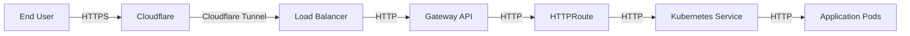
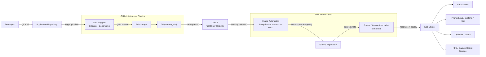
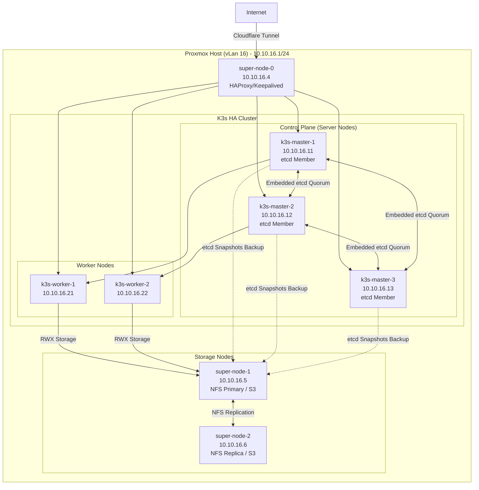
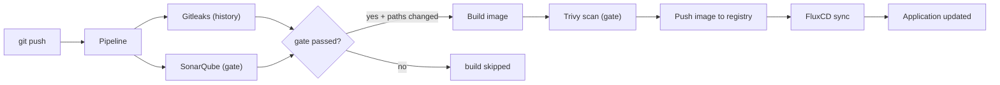

# K3s GitOps Platform on Proxmox

[](https://github.com/traipoap/gitops-platform/actions/workflows/pipeline.yml)


[](LICENSE)

แพลตฟอร์มระดับ production / portfolio สำหรับ provision และจัดการ Kubernetes cluster โดยใช้ Infrastructure as Code, GitOps, CI/CD, observability และ security

โครงการนี้แสดงวิธีสร้างแพลตฟอร์ม Kubernetes ที่ทำซ้ำได้ (repeatable) แบบ declarative และ automated ทั้งหมด ตั้งแต่ infrastructure (bare-metal/virtual) ไปจนถึงการ deploy แอปพลิเคชัน

---

## การตัดสินใจด้านสถาปัตยกรรม

การตัดสินใจสำคัญที่มีผลต่อแพลตฟอร์มนี้ และเหตุผลเบื้องหลัง

| # | การตัดสินใจ | ทางเลือกที่พิจารณา | เหตุผล |
|---|---|---|---|
| 1 | **ใช้ K3s แทน Kubernetes upstream** | kubeadm + K8s เต็มรูปแบบ, MicroK8s, k0s | Distribution แบบ single-binary ที่เหมาะกับ lab ทรัพยากรจำกัด (VM 1 vCPU / 2–8 GB): มี etcd และ containerd ในตัว ใช้แรมน้อย แต่ ecosystem-compatible (Helm, operators, Gateway API ใช้ได้เหมือนเดิม) |
| 2 | **HA ด้วย embedded etcd + token-based master join** | External DB (Postgres/MySQL) สำหรับ control plane | ไม่ต้องดูแล stateful service เพิ่ม — master ตัวแรก initialize cluster และสร้าง node token, `01-cluster-setup.yml` ส่งต่อ token ให้ master ตัวอื่น join อัตโนมัติ (`K3S_URL` + `K3S_TOKEN`) และถ้า control plane ใหญ่ขึ้นยังเลือก external DB เป็นขั้น hardening ได้ |
| 3 | **Super-node เดียว host LB + NFS + S3 + Vector** | VM แยกหนึ่งตัวต่อ infrastructure service | ฮาร์ดแวร์ lab จำกัดจำนวน VM จึงรวม stateful/edge services ไว้ใน VM เดียวเพื่อประหยัด RAM และดิสก์ ข้อแลกเปลี่ยน: เป็น single point of failure — ลดความเสี่ยงด้วยการทำ multi-node replication ของ Garage และ backup ข้อมูล NFS (ดูหัวข้อ Backup) |
| 4 | **Terraform จัดการวงจรชีวิต VM, Ansible จัดการซอฟต์แวร์** | Ansible ล้วน (สร้าง VM + ตั้งค่า), สคริปต์ Proxmox CLI | แบ่งขอบเขตชัด: Terraform ดูแล *infrastructure state* (clone จาก template, ดิสก์, IP, cloud-init) พร้อม plan/apply/destroy, Ansible ดูแล *desired software state* (roles แบบ idempotent) — ทั้งสองทำซ้ำได้จาก repo เดียว |
| 5 | **เพิ่ม/ลด node แบบ count-driven (`cluster_node_counts` + `cluster_node_specs`)** | กำหนด map entry แยก per VM | ขยาย cluster ได้ด้วยการเปลี่ยนตัวเลข 3 ตัวโดยไม่ต้อง duplicte block per-VM — vm_id / IP / hostname ถูกคำนวณตาม role ทำให้จำนวนเท่าไหร่ก็สอดคล้อง และหมดปัญหา error แบบ duplicate key ใน HCL |
| 6 | **GitOps ด้วย FluxCD แทน `kubectl` แบบ imperative** | `kubectl apply` ด้วยมือ, Argo CD | การเปลี่ยนแปลงทั้งหมดใน cluster ผ่าน GitOps repository — GitHub Actions push image tag และ Flux reconcile ให้อัตโนมัติ state drift ซ่อมตัวเอง (self-healing) และ audit trail อยู่ git |
| 7 | **Istio พร้อม Gateway API ปิด Traefik ของ K3s** | K3s built-in Traefik ingress, Ingress controller แยก | มาตรฐาน ingress ด้วย Gateway API + HTTPRoute เพื่อ mTLS, traffic policies และความเห็นภาพผ่าน Kiali — `--disable=traefik` ป้องกัน ingress controller สองตัวแย่งกันจัดการ route |
| 8 | **Storage 2 ชั้น: NFS (shared state) + Garage (object)** | Ceph, Longhorn, hostPath | StorageClass ของ NFS รองรับ stateful pod แบบไม่ต้องซับซ้อน Garage ให้ object storage แบบ S3-compatible พร้อม replication ทั้งสองรันบน super-node ที่ข้อมูลอยู่แล้ว หลีกเลี่ยงการพึ่งดิสก์ข้าม host |
| 9 | **Provision แบบ clone template (vm 2000, incremental clone)** | สร้าง VM ใหม่จาก ISO ทุกครั้ง | clone base image ที่ติดตั้งไว้แล้วทำให้ provision เร็ว (~3 นาที) และสม่ำเสมอ cloud-init snippet (สร้างโดย Terraform) แค่ inject ตัวตน — hostname, user, SSH keys, IP |
| 10 | **ชื่อ group ของ Ansible ใช้ underscore (`k3s_masters`, …)** | ชื่อ group แบบ hyphen | Hyphen ไม่ถูกใช้ในชื่อ group ของ Ansible (เกิด warning + พฤติกรรมไม่คาดฝันใน `hostvars`/`groups`) ส่วน roles ยังใช้ชื่อแบบ hyphen (`load-balance`) ได้ตามปกติ |
| 11 | **Secrets ผ่าน `secrets.auto.tfvars` (git-ignored) + `.env` สำหรับ Ansible** | Hardcode ค่า, Vault | ข้อมูลลับไม่เข้า git — Terraform อ่านจาก tfvars, Ansible อ่านจาก env vars ใน Option A ทำให้ไม่ต้องตอบ prompt แบบ interactive ใน CI |
| 12 | **Vector → Quickwit สำหรับ logging, Prometheus/Grafana/Kiali สำหรับ metrics/traces** | Loki/ELK, Jaeger | Stack เบากว่า เหมาะกับ lab — agent เดียว (Vector) ส่ง log, Quickwit รับ scale โดยไม่ต้องใช้ Elasticsearch เต็มชุด, Kiali เสริม Istio ด้าน service-mesh observability |

> การตัดสินใจเหล่านี้ให้ความสำคัญกับ **ความเรียบง่ายในการดำเนินงานภายในข้อจำกัดฮาร์ดแวร์ของ lab** ขณะเดียวกันยังใช้ component มาตรฐาน (Kubernetes API, Gateway API, S3, GitOps) ทำให้ repo เดียวสามารถขยายไปสู่ topology ระดับ production ได้โดยไม่ต้องเขียนใหม่

## สารบัญ
- [ภาพรวม](#ภาพรวม)
- [สภาพแวดล้อม Lab](#สภาพแวดล้อม-lab)
- [สถาปัตยกรรม](#สถาปัตยกรรม)
- [Network Topology Diagram](#network-topology-diagram)
- [ระยะเวลาการ Deploy](#ระยะเวลาการ-deploy)
- [ฟีเจอร์](#ฟีเจอร์)
- [ข้อกำหนดก่อนเริ่ม](#ข้อกำหนดก่อนเริ่ม)
- [Tech Stack](#tech-stack)
- [โครงสร้าง Repository](#โครงสร้าง-repository)
- [การเริ่มต้นใช้งาน (Quickstart)](#การเริ่มต้นใช้งาน-quickstart)
- [กระบวนการ GitOps](#กระบวนการ-gitops)
- [Pipeline CI/CD](#pipeline-cicd)
- [การตรวจสอบระบบ (Observability)](#การตรวจสอบระบบ-observability)
- [Storage](#storage)
- [ความปลอดภัย](#ความปลอดภัย)
- [สำรองข้อมูลและกู้คืน](#สำรองข้อมูลและกู้คืน)
- [การจัดการปัญหา (Troubleshooting)](#การจัดการปัญหา-troubleshooting)
- [ผลลัพท์ / ผลกระทบ](#ผลลัพท์--ผลกระทบ)
- [บทเรียนที่ได้รับ](#บทเรียนที่ได้รับ)
- [Roadmap](#roadmap)
- [การมีส่วนร่วม](#การมีส่วนร่วม)
- [License](#license)

---

## 🏗 ภาพรวม

โครงการนี้ automate การ deploy และจัดการ K3s Kubernetes cluster บน Proxmox virtual machines โดยใช้ Terraform และ Ansible

cluster ถูกจัดการด้วย GitOps workflow โดยใช้ FluxCD — infrastructure และ Kubernetes workloads ทั้งหมดถูกกำหนดไว้ใน Git และ FluxCD จะ reconcile สถานะของ cluster ให้ตรงกับ desired state ที่กำหนดไว้ใน repository อยู่เสมอ

แพลตฟอร์มประกอบด้วย:

- Provision VM และ infrastructure อัตโนมัติ
- ติดตั้ง Kubernetes cluster อัตโนมัติ
- จัดการ application และ infrastructure แบบ GitOps
- CI/CD pipeline โดยใช้ GitHub Actions
- Stack สำหรับ monitoring และ logging
- ความเห็นภาพของ service mesh ด้วย Istio และ Kiali
- Object storage โดยใช้ Garage
- จัดการ TLS อัตโนมัติด้วย cert-manager

---

## สภาพแวดล้อม Lab

แพลตฟอร์มถูก deploy บนสภาพแวดล้อม Proxmox lab แบบ single-node

| ทรัพยากร | สเปค |
|---|---:|
| CPU | 4 x Intel(R) Core(TM) i5-3470S CPU @ 2.90GHz (1 Socket) |
| RAM | 16 GB |
| Storage | 2 x 1 TB HDD, 1 x 500 GB HDD |
| Hypervisor | Proxmox VE 9.1.5 |

### การจัดสรร VM

VM ถูกสร้างแบบ **dynamic** จาก Terraform variables สองตัว — ไม่ต้องมี per-VM definitions ที่ต้องดูแล:

- `cluster_node_counts` — จำนวน VM ที่จะสร้างต่อ role (`super` / `master` / `worker`)
- `cluster_node_specs` — สเปคต่อ role (vm_id base, vCPU, RAM, IP base, ดิสก์)

Node `N` (เริ่มที่ 1) ของแต่ละ role จะได้รับชื่อ `<name-base>-N`, vm_id `<vm_id_base> + N - 1`, และ IP `<ip_base> + N - 1`:

| Role | รูปแบบชื่อ | vCPU | RAM | ดิสก์ | IP (vLan 16) |
|---|---|---:|---:|---:|---:|
| super | `super-node-N` | 1 | 2 GB | 32 GB + 100 GB | 10.10.16.4 + N−1 |
| master | `k3s-master-N` | 1 | 4 GB | 32 GB | 10.10.16.11 + N−1 |
| worker | `k3s-worker-N` | 1 | 8 GB | 32 GB | 10.10.16.21 + N−1 |

ตัวอย่าง cluster ขนาดขยาย (`cluster_node_counts = { super = 2, master = 2, worker = 2 }`):

| VM | Role | Network |
|---|---|---|
| super-node-1, super-node-2 | LB / NFS / S3 | 10.10.16.4, 10.10.16.5 |
| k3s-master-1, k3s-master-2 | K3s control plane (HA) | 10.10.16.11, 10.10.16.12 |
| k3s-worker-1, k3s-worker-2 | K3s worker nodes | 10.10.16.21, 10.10.16.22 |

> หมายเหตุ: สภาพแวดล้อม lab มีทรัพยากรจำกัด workloads จึงถูกกำหนด resource requests/limits ไว้ และ component ที่ไม่จำเป็นสามารถปิดได้เพื่อลดการใช้แรม

### Traffic Flow


---

## สถาปัตยกรรม



---

## Network Topology Diagram



---

## ระยะเวลาการ Deploy

| ขั้นตอน | เวลาโดยประมาณ |
|---|---|
| Terraform provision (สร้าง VM) | ~3 นาที |
| Ansible prerequisites + ติดตั้ง K3s | ~6 นาที |
| ติดตั้ง Istio | ~1 นาที |
| ตั้งค่า storage networking | ~1 นาที |
| ตั้งค่า S3 bucket | ~1 นาที |
| Bootstrap FluxCD | ~1 นาที |
| Reconcile ครั้งแรกทั้งหมด | ~6 นาที |
| **รวม** | **~20-25 นาที** |

---

## ฟีเจอร์
- Provision virtual machines บน Proxmox โดยใช้ Infrastructure as Code
- Automate ข้อกำหนดก่อนเริ่มและ kernel tuning ด้วย Ansible
- ติดตั้งและตั้งค่า K3s Kubernetes cluster
- จัดการ Kubernetes workloads ด้วย GitOps (FluxCD)
- Deploy infrastructure components ด้วย Kustomize และ Helm
- สร้างและ publish container images ด้วย GitHub Actions
- อัปเดต GitOps repository อัตโนมัติเมื่อสร้าง image ใหม่
- Monitor cluster และ workloads ด้วย Prometheus และ Grafana
- เห็นภาพ traffic ของ service mesh ด้วย Kiali
- เก็บและ query log ด้วย Vector และ Quickwit
- ให้ S3-compatible object storage ด้วย Garage
- จัดการ TLS certificates อัตโนมัติด้วย cert-manager
- เก็บ configuration ของ cluster แบบ declarative ใน Git

---

## ข้อกำหนดก่อนเริ่ม

ก่อนเริ่มใช้งาน ตรวจสอบว่าติดตั้งเครื่องมือเหล่านี้ไว้บน workstation แล้ว:

| เครื่องมือ | เวอร์ชันขั้นต่ำ | คำสั่งติดตั้ง |
|---|---|---|
| Terraform | ≥ 1.5 | `brew install hashicorp/tap/terraform` |
| Ansible | ≥ 2.15 | `pip install ansible-core` |
| kubectl | — | `kubectl version --client` |
| flux | ≥ 2.3 | `brew install fluxcd/tap/flux` |
| helm | ≥ 3.12 | `brew install helm` |
| Proxmox Terraform Provider | ล่าสุด | กำหนดค่าใน `terraform/provider.tf` |

### ความเข้ากันได้ของเวอร์ชัน

| Component | เวอร์ชัน |
|---|---|
| K3s | v1.31.x |
| FluxCD | ≥ 2.3 |
| Istio | 1.24.x |
| Proxmox VE | 8.x / 9.x |
| Terraform | ≥ 1.5 |
| Ansible | ≥ 2.15 |

---

## Tech Stack
### Infrastructure
- Proxmox VE
- Terraform
- Ansible
- Linux
- NFS
### Kubernetes
- CRUN Runtime
- Youki Runtime
- K3s
- kubectl
- Helm
- Kustomize
- FluxCD
- Istio
- cert-manager
### CI/CD
- GitHub Actions
- Docker
- Container Registry
### Observability
- Prometheus
- Grafana
- Kiali
- Vector
- Quickwit

### Storage
- NFS
- Garage Object Storage (S3-compatible)

---

## โครงสร้าง Repository

```
.
├── .github
│   └── workflows
│       ├── build-and-push.yml
│       └── pipeline.yml
├── ansible
│   ├── ansible.cfg
│   ├── inventory
│   │   └── hosts
│   ├── playbooks
│   │   ├── 00-prerequisites.yml
│   │   ├── 01-cluster-setup.yml
│   │   ├── 02-servicemesh.yml
│   │   ├── 03-storage-networking.yml
│   │   ├── 04-garage-deploy.yml
│   │   ├── 05-gitops-bootstrap.yml
│   │   └── quickstart.sh
│   └── roles
│       ├── common
│       │   └── tasks
│       │       └── main.yml
│       ├── fluxcd
│       │   └── tasks
│       │       └── main.yml
│       ├── garage
│       │   ├── tasks
│       │   │   └── main.yml
│       │   └── templates
│       │       ├── garage.toml.j2
│       │       └── systemd
│       │           └── garage.service.j2
│       ├── istio
│       │   └── tasks
│       │       └── main.yml
│       ├── k3s-agent
│       │   └── tasks
│       │       └── main.yml
│       ├── k3s-server
│       │   └── tasks
│       │       └── main.yml
│       ├── load-balance
│       │   ├── tasks
│       │   │   └── main.yml
│       │   └── templates
│       │       └── haproxy.cfg.j2
│       ├── nfs
│       │   ├── tasks
│       │   │   └── main.yml
│       │   └── templates
│       │       └── exports.j2
│       └── runtime
│           └── tasks
│               └── main.yml
├── backend
│   ├── config
│   │   ├── config.go
│   │   └── jwt.go
│   ├── controllers
│   │   ├── export_controller.go
│   │   ├── exports_list_controller.go
│   │   ├── protected_controller.go
│   │   ├── register_controller.go
│   │   ├── search_controller.go
│   │   └── signin_controller.go
│   ├── go.mod
│   ├── go.sum
│   ├── main.go
│   ├── middleware
│   │   └── jwt.go
│   ├── models
│   │   ├── export.go
│   │   ├── jwt.go
│   │   ├── register.go
│   │   └── search.go
│   ├── routers
│   │   └── routers.go
│   └── services
│       ├── download_service.go
│       ├── export_service.go
│       ├── jwt.go
│       └── quickwit_client.go
├── docker
│   ├── backend
│   │   └── Dockerfile
│   └── frontend
│       └── Dockerfile
├── frontend
│   ├── .vscode
│   │   ├── extensions.json
│   │   └── launch.json
│   ├── astro.config.mjs
│   ├── package.json
│   ├── package-lock.json
│   ├── public
│   │   ├── favicon.ico
│   │   └── favicon.svg
│   ├── src
│   │   ├── assets
│   │   │   ├── astro.svg
│   │   │   ├── background.svg
│   │   │   └── logout.svg
│   │   ├── components
│   │   │   └── Welcome.astro
│   │   ├── layouts
│   │   │   └── Layout.astro
│   │   ├── pages
│   │   │   ├── 404.astro
│   │   │   ├── dashboard.astro
│   │   │   ├── index.astro
│   │   │   ├── signin.astro
│   │   │   └── signup.astro
│   │   ├── scripts
│   │   │   └── dashboard.js
│   │   └── styles
│   │       ├── logs.css
│   │       ├── main.css
│   │       ├── signin.css
│   │       └── signup.css
│   └── tsconfig.json
├── terraform
│   ├── .terraform.lock.hcl
│   ├── backend.tf
│   ├── locals.tf
│   ├── main.tf
│   ├── provider.tf
│   ├── templates
│   │   ├── haproxy.tpl
│   │   └── hosts.tpl
│   └── variables.tf
├── .dockerignore
├── .gitignore
├── LICENSE
├── README.md
└── start-app.sh
```

> **ไฟล์เฉพาะเครื่อง (gitignored, สร้างตอนรัน):** `.env` / `.env.example` (root), `backend/.env`, `backend/data/users.db`, `backend/exports/` (exported CSVs + `.hash_registry.jsonl`), `frontend/.env`, `terraform/*.tfstate`, `terraform/secrets.auto.tfvars`.

---

## การเริ่มต้นใช้งาน (Quickstart)

### Checklist ข้อกำหนดก่อนเริ่ม

ก่อนรัน setup ตรวจสอบว่าทำรายการต่อไปนี้แล้ว:

- [ ] ติดตั้ง Terraform ≥ 1.5 บนเครื่องแล้ว
- [ ] ติดตั้ง Ansible ≥ 2.15 บนเครื่องแล้ว
- [ ] ติดตั้ง kubectl และ flux CLI แล้ว
- [ ] Proxmox VE 9.1.5 server พร้อม VM ที่ตั้งค่าไว้แล้ว
- [ ] สร้าง GitHub repository และเปิดใช้ GitHub Actions แล้ว
- [ ] สร้างไฟล์ `.env` พร้อม environment variables ที่จำเป็น
- [ ] ตั้งค่า SSH access ไปยัง Proxmox VMs แล้ว

### Clone repository
```bash
git clone https://github.com/traipoap/gitops-platform.git
cd gitops-platform
```

### คัดลอกไฟล์ environment ตัวอย่าง
```bash
cp .env.example .env
```

### แก้ไข .env ด้วยค่าของ environment
```bash
# Proxmox API token
cat >> terraform/secrets.auto.tfvars <<'EOF'
proxmox_endpoint = "https://proxmox.xxx.xxx"
proxmox_username = "xxx@pam"
proxmox_password = "xxx"
proxmox_ssh_username = "xxx"

ssh_username = "xxx"
ssh_public_keys = [
  "ssh-ed25519 xxx xxx@xxx-MacBook-Air.local",
  "ssh-ed25519 xxx xxx@xxx-desktop",
  "ssh-ed25519 xxx xxx@local"
]
cluster_node_counts = {
  super  = 1
  master = 1
  worker = 1
}
EOF

# RPC secret ระหว่าง nodes
export RPC_SECRET="$(openssl rand -hex 32)"
# Admin token ของ application backend
export ADMIN_TOKEN="$(openssl rand -base64 32)"
# ข้อมูลรับรองของ Garage (S3-compatible object storage)
export GARAGE_DEFAULT_ACCESS_KEY="GK$(openssl rand -hex 16)"
export GARAGE_DEFAULT_SECRET_KEY="$(openssl rand -hex 32)"
# GitHub PAT สำหรับเข้าถึง GitOps repository (FluxCD bootstrap)
export APP_GIT_SECRET="xxx"
```

### Provision infrastructure
```bash
cd terraform
terraform init
terraform login
terraform plan
terraform apply
```

### รัน Ansible playbooks
> **Multi-master (HA):** `01-cluster-setup.yml` รองรับ control plane node มากกว่าหนึ่งตัว — master ตัวแรกใน inventory จะ initialize K3s cluster, master ตัวอื่น join เป็น HA control plane replica (K3s embedded etcd) และ workers join เป็น agents หากต้องการ HA control plane ให้ตั้ง `cluster_node_counts.master = 3` (หรือมากกว่า) ก่อน `terraform apply` — Ansible จะจัดการที่เหลือให้อัตโนมัติ

#### Option A: Environment variables (แนะนำ — ไม่ต้องตอบ prompt แบบ interactive)
**bash / zsh:**
```bash
source .env
cd ansible
ansible-playbook -i inventory/hosts playbooks/00-prerequisites.yml
ansible-playbook -i inventory/hosts playbooks/01-cluster-setup.yml
ansible-playbook -i inventory/hosts playbooks/02-servicemesh.yml
ansible-playbook -i inventory/hosts playbooks/03-storage-networking.yml
ansible-playbook -i inventory/hosts playbooks/04-garage-deploy.yml
ansible-playbook -i inventory/hosts playbooks/05-gitops-bootstrap.yml
```
> เมื่อมี environment variables อยู่แล้ว Ansible จะใช้ค่าเหล่านั้นโดยตรงและข้ามการถามแบบ interactive

#### Option B: โหมด interactive (ไม่มี env vars — จะถามค่าที่ต้องการ)
```bash
cd ansible
ansible-playbook -i inventory/hosts playbooks/00-prerequisites.yml
ansible-playbook -i inventory/hosts playbooks/01-cluster-setup.yml
ansible-playbook -i inventory/hosts playbooks/02-servicemesh.yml
ansible-playbook -i inventory/hosts playbooks/03-storage-networking.yml
ansible-playbook -i inventory/hosts playbooks/04-garage-deploy.yml # ถามค่า credentials ของ garage (เว้นว่างเพื่อสร้างอัตโนมัติ)
ansible-playbook -i inventory/hosts playbooks/05-gitops-bootstrap.yml # ถามค่า FluxCD และ GitHub PAT
```

---

## กระบวนการ GitOps
โครงการนี้ใช้ FluxCD เป็น GitOps operator
FluxCD จะเฝ้า repository นี้และ reconcile สถานะของ cluster โดยใช้:
- GitRepository
- Kustomization
- HelmRepository
- HelmRelease

Bootstrap FluxCD:
```bash
flux bootstrap github \
      --owner=traipoap \
      --repository=fleet-infra \
      --branch=main \
      --path=./clusters/staging \
      --personal
```

ดูสถานะ FluxCD:
```bash
flux get all -A
```

ดู Kubernetes resources:
```bash
kubectl get nodes
kubectl get pods -A
kubectl get gitrepositories -A
kubectl get kustomizations -A
kubectl get helmreleases -A
```
---

## Pipeline CI/CD
Pipeline CI/CD ใช้ GitHub Actions

เมื่อ push code เข้า repository pipeline เดียว (`.github/workflows/pipeline.yml`) จะทำงาน:
1. **Security gate** (ทุกการ push / PR): Gitleaks สแกน secret ทั้ง history + SonarQube วิเคราะห์คุณภาพและความปลอดภัยของโค้ด
2. **Build ต่อ service** — เฉพาะ service ที่มี path เปลี่ยน **และเมื่อ security gate ผ่านเท่านั้น** (ถ้า Gitleaks หรือ SonarQube fail จะ skip build ทั้งหมด)
3. สร้าง Docker image
4. สแกน image ด้วย **Trivy** **ก่อน** push — gate ระดับ CRITICAL/HIGH ทำให้ image ที่มีช่องโหว่ไม่มีทางเข้า registry (SARIF ถูกส่งขึ้น Security tab)
5. Push image ไป container registry (GHCR)
6. FluxCD พบ tag ใหม่และ deploy ให้อัตโนมัติ

> การอัปเดต image tag ใน GitOps repository จัดการโดย FluxCD bootstrap configuration ใน repo นั้นเอง; pipeline เองหยุดที่ image ที่ผ่านการตรวจสอบและถูก push แล้ว

### Repository secrets และ variables ที่จำเป็น

| Type | Name | ตัวอย่างค่า | ใช้โดย |
|---|---|---|---|
| Variable | `SONAR_HOST_URL` | `http://10.10.16.4:9000` | SonarQube job |
| Secret | `SONAR_TOKEN` | `sonarqube_…` | SonarQube job |
| Secret | `TOKEN_REGISTRY` | GHCR fine-grained PAT | ขั้นตอน build และ Trivy |

> ที่อยู่ server และ credentials มาจาก **Settings → Secrets and variables → Actions** — ไม่ hardcode IP, token หรือ secret ไว้ใน workflow file ใด ๆ และ **project key** ของ SonarQube ไม่จัดเป็น secret จึงเก็บใน [`sonar-project.properties`](sonar-project.properties) ที่ root ของ repo (ต้องตรงกับ project ที่มีอยู่บน server SonarQube ของคุณ)

### ตัวอย่าง workflow


---

## การตรวจสอบระบบ (Observability)
### Prometheus
ใช้ Prometheus เก็บ metrics จาก cluster และ workloads

**เข้าถึงแบบ local:**
```bash
kubectl -n istio-system port-forward svc/prometheus-server 9090:9090
```
เปิด: <http://localhost:9090>

### Grafana
ใช้ Grafana สำหรับ dashboard และการ visualize

**เข้าถึงแบบ local:**
```bash
kubectl -n istio-system port-forward svc/grafana 3000:3000
```
เปิด: <http://localhost:3000>

### Kiali
Kiali ให้มุมมอง traffic ของ Istio service mesh

**เข้าถึงแบบ local:**
```bash
kubectl -n istio-system port-forward svc/kiali 20001:20001
```
เปิด: <http://localhost:20001>

### Logging
log ถูกเก็บด้วย Vector และถูกจัดเก็บ/ค้นหาได้ใน Quickwit

**ดู log pods:**
```bash
kubectl -n lumina get pods
kubectl -n lumina logs -l app.kubernetes.io/name=vector
```
**เข้าถึง Quickwit UI:**
```bash
kubectl -n lumina port-forward svc/quickwit-searcher 7280:7280
```
เปิด: <http://localhost:7280>

---

## Storage
### NFS
ใช้ NFS สำหรับ persistent storage ในสภาพแวดล้อม lab นี้

**ตัวอย่าง StorageClass:**
```yaml
apiVersion: storage.k8s.io/v1
kind: StorageClass
metadata:
  name: nfs-subdir-external-provisioner
provisioner: cluster.local/nfs-subdir-external-provisioner
parameters:
  server: 10.10.16.4
  path: /nfs
reclaimPolicy: Delete
volumeBindingMode: Immediate
```

### Garage Object Storage
Garage ให้ object storage แบบ S3-compatible

**ตัวอย่างการใช้:**
- Backup storage
- asset ของแอปพลิเคชัน
- Registry storage backend
- ทดสอบ S3-compatible

---

## ความปลอดภัย
### แนวปฏิบัติที่นำไปใช้แล้ว
- TLS certificates จัดการโดย cert-manager
- configuration แบบ declarative จัดการผ่าน Git
- แยก secrets ออกจาก application manifests
- namespace isolation
- RBAC ควบคุมสิทธิ์การเข้าถึง
- best practices ด้านความปลอดภัยของ pod
- reconcile อัตโนมัติเพื่อลด configuration drift
- External Secrets Operator
- สแกน container image (Trivy ใน CI)
- private registry authentication
- บังคับใช้ Kyverno policies

### สิ่งที่แนะนำเพิ่มเติม
- SOPS + age สำหรับเข้ารหัส secret
- NetworkPolicies
- ลงลายเซ็น container images

---

## Backup and Restore (สำรองข้อมูลและกู้คืน)
### เป้าหมายการ backup ที่แนะนำ
- etcd snapshots
- Kubernetes resource manifests
- Persistent volumes
- GitOps repository
- Secrets
- ข้อมูล NFS
- ข้อมูล Garage object storage

### ตัวอย่างเครื่องมือ
- Velero
- Kopia
- Restic
- etcd snapshot
- Longhorn snapshots (กรณีใช้ Longhorn)

> 📝 ขั้นตอน backup/restore ละเอียดอยู่ใน [docs/backup-restore.md](docs/backup-restore.md) ถ้ายังไม่มีไฟล์นี้ อยู่ในแผน Roadmap

---

## การจัดการปัญหา (Troubleshooting)
ตรวจสอบสถานะ node
```
kubectl get nodes -o wide
kubectl describe node <node-name>
```

ตรวจสอบสถานะ pod
```
kubectl get pods -A
kubectl describe pod <pod-name> -n <namespace>
kubectl logs <pod-name> -n <namespace>
kubectl logs <pod-name> -n <namespace> --previous
```

ตรวจสอบสถานะ FluxCD
```
flux get all -A
flux get kustomizations -A
flux get helmreleases -A
```

บังคับให้ FluxCD reconcile
```
flux reconcile source git flux-system -n flux-system
flux reconcile kustomization <name> -n <namespace> --with-source
```

ตรวจสอบสถานะ HelmRelease
```
kubectl describe helmrelease <name> -n <namespace>
kubectl get events -n <namespace> --sort-by=.metadata.creationTimestamp
```

---

## ผลลัพท์ / ผลกระทบ
- ลดเวลา provisioning infrastructure จากหลายชั่วโมงเหลือประมาณ 20 นาที
- ลบขั้นตอน manual ของการ deploy Kubernetes ออกไปโดยใช้ GitOps
- เพิ่มความสม่ำเสมอของ environment โดยกำหนด workloads ทั้งหมดแบบ declarative
- สร้าง cluster ใหม่ซ้ำได้ (repeatable rebuild) จาก Git และสคริปต์ automation
- เพิ่ม observability ด้วย Prometheus, Grafana, Kiali และ centralized logging
- ลด configuration drift ด้วย continuous reconciliation ของ FluxCD

---

## บทเรียนที่ได้รับ
- GitOps ดีกว่า `kubectl apply` แบบ manual ทั้งด้านความสม่ำเสมอและการ audit
- Infrastructure automation ต้องจัดการ secrets และ state files อย่างระมัดระวัง
- Observability ควรติดตั้งตั้งแต่วันแรก ไม่ใช่หลังเกิดปัญหา
- การทดสอบ backup/restore สำคัญเท่ากับ automation การ deploy
- การ debug Kubernetes ต้องอาศัยพื้นฐาน Linux และ networking ที่แข็งแกร่ง

---

## Roadmap

### ✅ ทำแล้ว — มาตรฐานความปลอดภัย CI/CD
- Security gate ก่อน build: Gitleaks (สแกน secret ทั้ง history) + SonarQube (quality gate — fail = ไม่ build)
- สแกนช่องโหว่ image ด้วย Trivy **ก่อน** push ขึ้น GHCR (gate ระดับ CRITICAL/HIGH + SARIF ใน Security tab)
- Build แบบ filter ตาม path — build เฉพาะ service ที่เปลี่ยน
- รวม IP/token ทั้งหมดใน Actions Variables & Secrets — ไม่ hardcode ใน workflow เลย

### ถัดไป — DevOps Engineering

**Reliability และ disaster recovery**
- Velero backup พร้อม **ทดสอบ restore เป็นประจำ** (backup ที่ไม่เคย restore ไม่ถือว่า backup)
- DR runbook พร้อม **วัดค่า RTO/RPO** จริง สำหรับ K3s cluster + ข้อมูล Quickwit
- Ceph แทน NFS สำหรับ replicated storage ระดับ production

**GitOps maturity และ policy-as-code**
- บังคับใช้ Kyverno policies (required labels, resource quotas, ห้าม privileged containers)
- NetworkPolicies สำหรับ namespace isolation (default-deny posture)
- External Secrets Operator — ย้าย secrets **ออกจาก GitOps repo ทั้งหมด**
- Multi-environment promotion: dev → staging → production พร้อม stacked GitOps configs และ gate ต่อ environment

**Pipeline และ supply chain**
- OIDC (workload identity) สำหรับ push GHCR — ทิ้ง registry PAT แบบ long-lived
- ตรวจสอบ Kubernetes manifests เป็น gate ของ pipeline (kubeconform + `kubectl apply --dry-run=server`)
- ลงลายเซ็น image ด้วย cosign + Flux verification พร้อม SBOM (syft) เผยแพร่เป็น build artifacts
- OpenTelemetry end-to-end tracing + Prometheus alert rules และ SLO dashboards สำหรับตัวแพลตฟอร์มเอง

---

## การมีส่วนร่วม
ยินดีต้อนรับการมีส่วนร่วม! สามารถ:

- เปิด [issue](https://github.com/traipoap/gitops-platform/issues) สำหรับ bug หรือ feature requests
- ส่ง [pull request](https://github.com/traipoap/gitops-platform/pulls) เพื่อปรับปรุง

เมื่อส่งการเปลี่ยนแปลง กรุณาตรวจสอบว่าทำตามสไตล์เดิมและอัปเดตเอกสารประกอบ

---

## License

โปรเจกต์นี้ใช้ license Apache 2.0 – ดูรายละเอียดในไฟล์ [LICENSE](LICENSE)